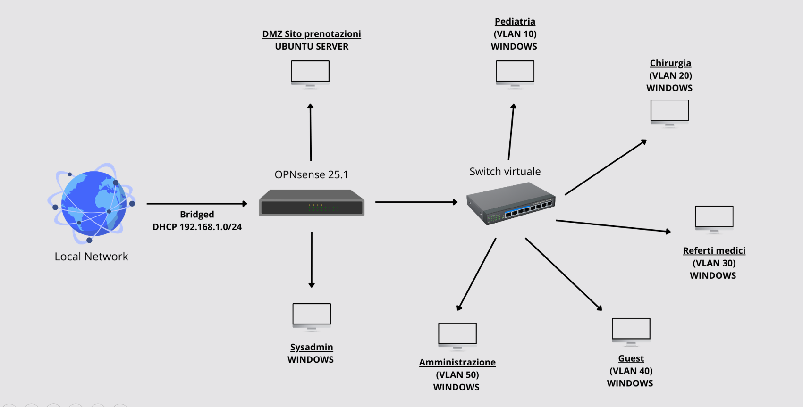

# OPNsense + Zenarmor – NGFW Implementation in a Simulated Hospital Network

## 🎥 Project Video

🔗 **[Click here to watch the full video on YouTube](https://www.youtube.com/watch?v=14oHS5KB80M)**

> 🗣️ **Language:** Italian  
> 📺 **English subtitles available** via YouTube captioning

---

## 🧠 Project Overview

This project demonstrates the implementation of a segmented hospital network using the open-source **OPNsense** firewall and the **Zenarmor** Next-Generation Firewall (NGFW) plugin.

The system was entirely built in a virtual lab environment using VMware, with the aim of simulating realistic inter-network traffic and security policy enforcement. The project includes the deployment of virtual machines, firewall configuration, policy implementation, and simulated cyberattacks with traffic inspection.

---

## 📌 Video Timeline

00:00 - Introduction to OPNsense

06:32 - Network Topology Overview

11:21 - Virtual Network Setup in VMware

13:11 - Installing OPNsense

14:22 - Initial CLI Configuration

16:58 - GUI Firewall Setup

18:21 - Interface Configuration

19:47 - DHCP Configuration for Surgical Network

22:03 - Connectivity Test

24:18 - General Firewall Rules Table

28:33 - Adding Firewall Rules

34:56 - Connectivity Test & Logs: RDP Attempt from Surgery to Medical Records

38:09 - Connectivity Test & Logs: SFTP Attempt from Pediatrics to Medical Records

47:35 - Zenarmor Overview

53:08 - Zenarmor Interface Integration

59:57 - Guest Network Policy Configuration

1:12:37 - Guest Network Policy Testing

1:17:50 - Medical Records Network Policy Configuration

1:19:53 - Medical Records Network Policy Testing

1:26:19 - Brute-force Attack Simulation from Guest to Medical Records (RDP)

1:35:22 - Final Thoughts

---

## 🖧 Network Topology

The simulated network consists of 7 segments, each representing a functional area within a hospital environment. VLANs are used to logically separate the zones, and all traffic is routed and filtered via OPNsense 25.1.

### 🧩 VLAN Mapping

| VLAN ID | Zone              | OS          |
|---------|-------------------|-------------|
| 10      | Pediatrics         | Windows     |
| 20      | Surgery            | Windows     |
| 30      | Medical Records    | Windows     |
| 40      | Guest              | Windows     |
| 50      | Administration     | Windows     |
| -       | SysAdmin           | Windows     |
| -       | DMZ – Web Server   | Ubuntu      |

**Note:**  
- The SysAdmin zone is directly connected to the OPNsense LAN interface for secure access.  
- The DMZ hosts a public-facing web service for booking, isolated on a dedicated interface.

---

## 🎯 Objectives

- Install and configure **OPNsense** as the perimeter firewall
- Integrate and enable **Zenarmor** as NGFW for traffic inspection and advanced policy enforcement
- Apply **custom firewall rules** between internal segments
- Perform **connectivity tests** and analyze **real-time firewall logs**
- Simulate attacks (e.g., brute-force on RDP) to validate policy effectiveness

---

## 🧰 Technologies Used

- [OPNsense](https://opnsense.org/) (FreeBSD-based open-source firewall)
- [Zenarmor](https://www.zenarmor.com/) (NGFW plugin)
- VMware Workstation
- Kali Linux (attack simulation)
- Ubuntu Server (DMZ web service)

---

---

## 📜 License

This project is released under the **MIT License**.  
Free to use for educational and research purposes. Please credit the author where applicable.

---

## 🙋 Author & Contact

Created by **Alberto Cirillo**, Cybersecurity student.  
🔗 [thevirtueye.com](https://thevirtueye.com)

