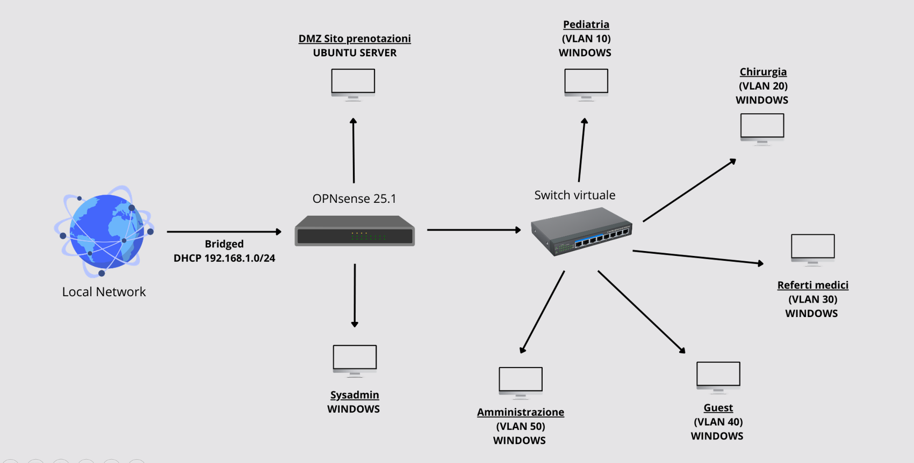

# OPNsense + Zenarmor – NGFW Implementation in a Simulated Hospital Network

## Project Video

**[Click here to watch the full video on YouTube](https://www.youtube.com/watch?v=14oHS5KB80M)**

> **Language:** Italian  
> **English subtitles available** via YouTube captioning

---

## Project Overview

This project demonstrates the implementation of a segmented hospital network using the open-source **OPNsense** firewall and the **Zenarmor** Next-Generation Firewall (NGFW) plugin.

The entire infrastructure was built in a virtual lab environment using **VMware Workstation**, simulating a realistic hospital scenario with seven isolated network segments. The project covers network segmentation via VLANs, firewall rule creation, DHCP/DNS configuration, NGFW policy enforcement with Zenarmor (Deep Packet Inspection, App/Web Controls), connectivity testing, real-time log analysis, and simulated cyberattacks to validate policy effectiveness.

---

## Video Timeline

00:00 - Introduction to OPNsense

06:32 - Network Topology Overview

11:21 - Virtual Network Setup in VMware

13:11 - Installing OPNsense

14:22 - Initial CLI Configuration

16:58 - GUI Firewall Setup

18:21 - Interface Configuration

19:47 - DHCP Configuration for Surgical Network

22:03 - Connectivity Test

24:18 - General Firewall Rules Table

28:33 - Adding Firewall Rules

34:56 - Connectivity Test & Logs: RDP Attempt from Surgery to Medical Records

38:09 - Connectivity Test & Logs: SFTP Attempt from Pediatrics to Medical Records

47:35 - Zenarmor Overview

53:08 - Zenarmor Interface Integration

59:57 - Guest Network Policy Configuration

1:12:37 - Guest Network Policy Testing

1:17:50 - Medical Records Network Policy Configuration

1:19:53 - Medical Records Network Policy Testing

1:26:19 - Brute-force Attack Simulation from Guest to Medical Records (RDP)

1:35:22 - Final Thoughts

---

## Network Topology

The simulated network consists of 7 segments, each representing a functional area within a hospital environment. VLANs are used to logically separate the zones, and all traffic is routed and filtered via OPNsense 25.1.

### VLAN Mapping

| VLAN ID | Zone              | Subnet              | OS          | Role                                  |
|---------|-------------------|----------------------|-------------|---------------------------------------|
| 10      | Pediatrics         | 192.168.10.0/24     | Windows     | Clinical department                   |
| 20      | Surgery            | 192.168.20.0/24     | Windows     | Clinical department                   |
| 30      | Medical Records    | 192.168.30.0/24     | Windows     | Sensitive data storage (SFTP server)  |
| 40      | Guest              | 192.168.40.0/24     | Windows     | Isolated guest access                 |
| 50      | Administration     | 192.168.50.0/24     | Windows     | Administrative operations             |
| -       | SysAdmin           | 192.168.254.0/24    | Windows     | Firewall management (LAN interface)   |
| -       | DMZ – Web Server   | 172.16.1.0/24       | Ubuntu      | Public-facing booking web service     |

**Note:**  
- The SysAdmin zone is directly connected to the OPNsense LAN interface for secure management access.  
- The DMZ hosts a public-facing web service for hospital bookings, isolated on a dedicated interface.

---

## Firewall Policy Summary

| From \ To        | Pediatrics | Surgery | Medical Records | Guest | Administration | SysAdmin | Internet          | DMZ              |
|------------------|:----------:|:-------:|:---------------:|:-----:|:--------------:|:--------:|:-----------------:|:----------------:|
| **Pediatrics**   | ✅         | ❌      | ✅ ¹            | ❌    | ❌             | ❌       | ✅ ²              | ✅               |
| **Surgery**      | ❌         | ✅      | ✅ ¹            | ❌    | ❌             | ❌       | ✅ ²              | ✅               |
| **Medical Rec.** | ❌ ³       | ❌ ³    | ✅              | ❌    | ❌ ³           | ❌       | ❌                | ✅               |
| **Guest**        | ❌         | ❌      | ❌              | ✅    | ❌             | ❌       | ✅ ²              | ✅               |
| **Administration**| ❌        | ❌      | ✅ ¹            | ❌    | ✅             | ✅       | ✅ ²              | ✅ ⁴             |
| **SysAdmin**     | ✅         | ✅      | ✅              | ✅    | ✅             | ✅       | ✅                | ✅               |
| **Internet**     | ❌         | ❌      | ❌              | ❌    | ❌             | ❌       | ✅                | ✅               |
| **DMZ**          | ❌         | ❌      | ❌              | ❌    | ❌             | ❌       | ✅ ⁵              | ✅               |

> **Notes:**
> 1. SFTP only — read and transfer of own department records to local machine.
> 2. Filtered via Zenarmor NGFW policy.
> 3. Pull model — Medical Records does not initiate connections; other departments pull data from it.
> 4. SFTP only — read and transfer of clinical records and bookings to local machine + web access.
> 5. HTTPS only.

---

## Objectives

- Install and configure **OPNsense 25.1** as the perimeter firewall on VMware Workstation
- Segment the network into **seven isolated zones** (five VLANs + SysAdmin + DMZ) with dedicated policies
- Configure **DHCP, DNS, and static IP addressing** for each segment with local domain resolution (`.ospedale.lan`)
- Integrate and enable **Zenarmor** as NGFW for Layer 7 traffic inspection and advanced policy enforcement
- Apply **custom firewall rules** implementing the principle of least privilege across all internal segments
- Configure **SFTP-only access** between clinical departments and Medical Records using Bitvise SSH Server with chroot isolation
- Define **Zenarmor policies** for Guest and Medical Records networks, including App Controls, Web Controls, Security categories, and per-IP whitelist exceptions
- Perform **connectivity tests** and validate rules using **real-time firewall logs** (OPNsense Live View)
- Simulate a **brute-force RDP attack** from the Guest network (Kali Linux + Ncrack) to validate Zenarmor detection and blocking capabilities
- Use **OPNsense aliases** to simplify rule management for multi-network blocking

---

## Key Features Demonstrated

- **Stateful Firewall** with per-interface rule management across seven network segments
- **VLAN-based segmentation** for logical isolation of hospital departments
- **DHCP Server** with custom address pools and domain names per network segment (e.g., `chirurgia.ospedale.lan`)
- **DNS Resolver** acting as local DNS with DNSSEC support, using Cloudflare upstream (1.1.1.1 / 1.0.0.1)
- **Zenarmor NGFW integration** providing Deep Packet Inspection (DPI) at Layer 7
- **App Controls** for blocking application-level traffic (Social Networks, Gaming, Streaming, Proxy, Remote Access)
- **Web Controls** for category-based website filtering (Adult, Gambling, Hate/Violence)
- **Essential & Advanced Security** policies blocking malware, phishing, botnet C&C, DNS tunneling, spyware, and newly registered domains
- **Per-IP whitelist exceptions** within Zenarmor policies for granular access control
- **Alias-based rules** (RetiLocaliOspedale) for efficient multi-network blocking in a single firewall rule
- **SFTP chroot isolation** via Bitvise SSH Server — per-department folders with read-only access
- **Real-time log analysis** via OPNsense Live View and Zenarmor Reports (Connections, Threats, Blocks, Web, DNS, TLS)
- **Live Sessions monitoring** for dynamic traffic analysis and anomaly detection
- **Brute-force attack simulation** (Ncrack RDP) with real-time Zenarmor detection and blocking
- **AMTSO security testing** to validate malware/virus blocking policies on the Guest network

---

## Technologies Used

- [OPNsense 25.1](https://opnsense.org/) (FreeBSD-based open-source firewall)
- [Zenarmor](https://www.zenarmor.com/) (NGFW plugin with DPI engine)
- VMware Workstation (virtualization platform)
- Windows (hospital department environments)
- Kali Linux (attack simulation — Ncrack brute-force)
- Ubuntu Server (DMZ web service)
- Bitvise SSH Server (SFTP server with chroot and per-user permissions)
- WinSCP (SFTP client for secure file transfer)

---

## License

This project is released under the **MIT License**.  
Free to use for educational and research purposes. Please credit the author where applicable.

---

## Author

Created by **Alberto Cirillo** — 2025
